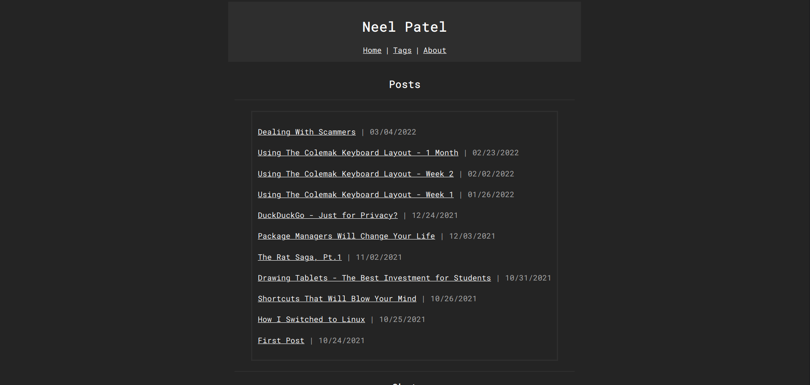

<!---
title:New Site Layout
date:Tues, 26 Apr 2022 11:00:00 EST
description:After about four months of working on/off on a new website layout, I've finally gotten to the point where I can share my website again
--->

## New Site Layout

### 2022-04-26

After about four months of working on/off on a new website layout, I've finally gotten to the point where I can share my website again! It took a lot longer because I actually started again from scratch.

Not only did I make a new HTML/CSS layout, but I also made my own "blog engine". It is a simple Python script that converts Markdown files into HTML files, as well as updating the RSS feed, JSON file, and the blog HTML file so that you can access it from my website. I was using [Jekyll](https://jekyllrb.com/) earlier, which honestly is perfectly fine for my website, however it felt too easy. I didn't really understand exactly what Jekyll was doing, but by making that Python script, I can see a bigger picture. My reasoning while I was making the script was that I felt that Jekyll was bloated and was too feature-rich, but what bothered me the most is that Jekyll has way too many dependencies. Unlike Jekyll, my Python script depends on two Python libraries: Markdown (to convert Markdown to HTML) and sys (to be able to use arguments straight from the terminal).

While you can do what I did, I highly doubt that what I'm doing is technically correct and following normal web standards/procedures. Not only that, but writing the script without really understanding the technology can be daunting. Jekyll is still very good if all you're looking for is a blog engine. It's quick to set up, very hassle-free, and is super easy to use.

In terms of features, my new website has gained and lost some. I'm no longer using tags, although I don't think it would be too difficult to add back (I will probably not though), but I think the feature I replaced it with is significantly better. I made my blogs searchable on my website. It uses a little bit of Javascript and a JSON file.[Web Dev Simplified](https://youtu.be/TlP5WIxVirU) made a great video that I followed to implement it in my website. Once again, this is not using any JS libraries or frameworks; it's just plain old Javascript.

My home page also has random images everytime you refresh the page (using a simple Javascript script that selects a random number and chooses an image based on the array of images). I will be adding more in the future, and will also need to manually compress them as well since collectively they are about the same size as the rest of the website.

Overall, I'm very pleased with the design of my website. There are things I still want to add, such as comments under my blog posts as well as implementing random web apps on my website. If you're feeling nostalgic for the old design, here's my final screenshot before I published the new layout.

