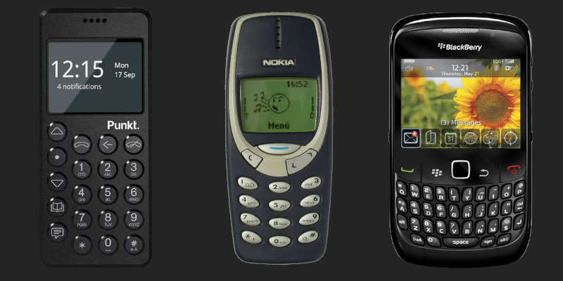

<!---
title:I Deleted Social Media
date:Mon, 29 Aug 2022 13:00:00 EST
description:Talking about the effects of social media, why I stopped, and the solutions to this problem.
--->

## I Deleted Social Media

### 2022-05-18

About a month ago, I deleted most of the social media apps off of my phone and it may have changed my life.

Ok that was hyperbolic but there is some truth in it. Prior to this, I would go on Instagram, Reddit, and Twitter only to find stale content or horrible takes that would make me unnecessarily mad. In fact, Kid Cudi getting booed off stage at Rolling Loud because he wasn't Kanye West was the nail in the coffin for me to realize that most people are just lost causes.

### Why Did I Delete Social Media?

My reasons differ slightly for each app but they all have the same underlying "problems". Social Media companies generate revenue by feeding users with ads. As a result, it is in their best interest to ensure that you are on their app for as long as possible.

The algorithms in these apps are extremely advanced, especially since they've had a decade to mature. These days, it's so easy to just keep on scrolling through the never-ending stream of content that's tailored just for you. The algorithm can work in different ways. Oftentimes, they will be your personal yes man and cater to your biases and may even enable it further. This leads to echo chambers and radicalization. Twitter doesn't always fit this mould and will sometimes throw a curveball at you as you read the most idiotic thing a human could possibly write within the confines of 280 characters.

I remember sifting through boring posts until finding the diamond in the rough once every minute or so, signaling a rush of dopamine, and making me want more. I would continue this cycle over and over until I would snap out of it. This sounds horrible, but that's the algorithm working _properly_, which is honestly the scariest part.

There are many other reasons as to why social media is bad for you. Besides the ones that were probably mentioned in those school assemblies, I think the most underrated reason is that it's an overload of information. The human brain has limits on how much it can take in. The internet has an endless flow of information, and social media is the vessel that can easily carry that information to their users. Another major reason to slow down social media usage is that there are many security/privacy violations as they are basically data mines.

### The Solution: Using a Dumbphone?

To alleviate the problem of social media controlling our lives, I'm starting to notice the "anti-smartphone" revolution beginning. People are ditching their smartphones for a "dumbphone" (or a feature phone) like those Nokia and Blackberry phones from 15-20 years ago. This may be the perfect solution for you. These phones really can only call and text, and may have an internet browser, but don't have any social media apps.

However, I don't think this is suitable for the average person living in a world dominated by smartphones. These are literal computers that can fit in your pocket; they can do way more than just be an entertainment machine. You can scan QR codes, take pictures that are comparable to point-and-shoot cameras, listen to music, browse the internet, use the GPS, check your email, and much, much, much more. Additionally, the keyboards on even the cheapest Android phones are lightyears ahead from physical keyboards, which are clunky and don't have predictive text or autocorrect. On top of that, a smartphone can be converted into a feature phone with a little bit of work, but a feature phone cannot be converted into a smartphone.

### The _Actual_ Solution

It's not as simple as deleting social media instantly. You will likely just download the app again shortly after.

#### Identify what you are wasting the most time on.

Not everything is bad on social media. My biggest gripe with social media is the algorithm, not seeing my friend's pictures or whatever. For me, mindlessly scrolling through the Instagram explore page/reels and Twitter was something I wanted to stop.

#### Tweak settings within the app.

For Twitter, I recommend switching to latest tweets. If you have notifications enabled, adjust them in your settings so that you only receive important ones. Knowing that someone liked your latest photo does not need your immediate attention as much as a message from a family member for example.

### App Timers

If there's one thing you should do, even if you don't intend on deleting social media, it would be to set an app timer. This is a feature that's on Android and iOS which allows you to limit how much time you can spend on any app so that you don't end up going past your daily amount.

Start slowly. I started with a 1 hour limit, which was good enough for me to get my fix, but it made sure that I didn't overstay my welcome. Every week or so, I would lower it down. Sometimes I would fail and manually bring the timer up back to an hour, but I'd try again and again until I got to a point where I was comfortable with 20 minutes. Like I mentioned, not everything on social media is bad, so if you just limit your social media usage even a little, it can be very beneficial.

#### Deleting your profile

If you know you won't be using that social media ever again, then you should probably delete the profile entirely. For me, I've kept mine in case I need to use it in the future. This is especially important for me as a university student. I know many people will prefer to send me a message on social media over a messaging app.

#### Alternative/Frontend apps

There are many alternative apps to remove the algorithm aspect. Honestly they are nowhere near as functional as their official counterparts since they are either frontends to proprietary software and break very easily or are entirely different apps and don't have the same users. One day, they may actually get better though. Here are some frontends that I found:

[Piped (Youtube)](https://piped.kavin.rocks/)

[Invidious (Youtube)](https://invidious.io/)

[Nitter (Twitter)](https://nitter.net/)

[Libreddit (Reddit)](https://libredd.it/)

[Teddit (Reddit)](https://teddit.net/)

There are many more, but these are the ones that I can actually see being used regularly if you still want to use social media.

#### RSS Feeds

I will probably make another post about RSS, but the short of it is that instead of searching for content on different websites, you can just subscribe to them and have them all appear in one instance like an app on your phone or a desktop program. It's very popular amongst blogs, news sites, and podcasts. My website's blog also has an [RSS feed](https://notneelpatel.github.io/feed.xml) so that you can read my blogs without having to actually visit my website.

#### What now?

Upon your departure from social media, you may need to kill time or need something else to fill the void. I would suggest reading or taking on a new hobby as that's generally a good way to cure any addiction. I personally have been reading manga. I've also subscribed to many other RSS feeds.

### Conclusion

Social media 15 years ago was a novel concept. It truly was revolutionary to be able to share content with everyone all on one platform, but as the years have gone by, these companies have neglected their users in pursuit of money and power. As much as they want you to think that they care about your mental well-being or whatever, they will do anything in their power to exploit you as much as they can. This is just another reason why I think you should be cool like me and have a website if you don't already.

I hope that you learned something and will be a little more careful with the time you spend on social media. I really appreciate you reading this.
